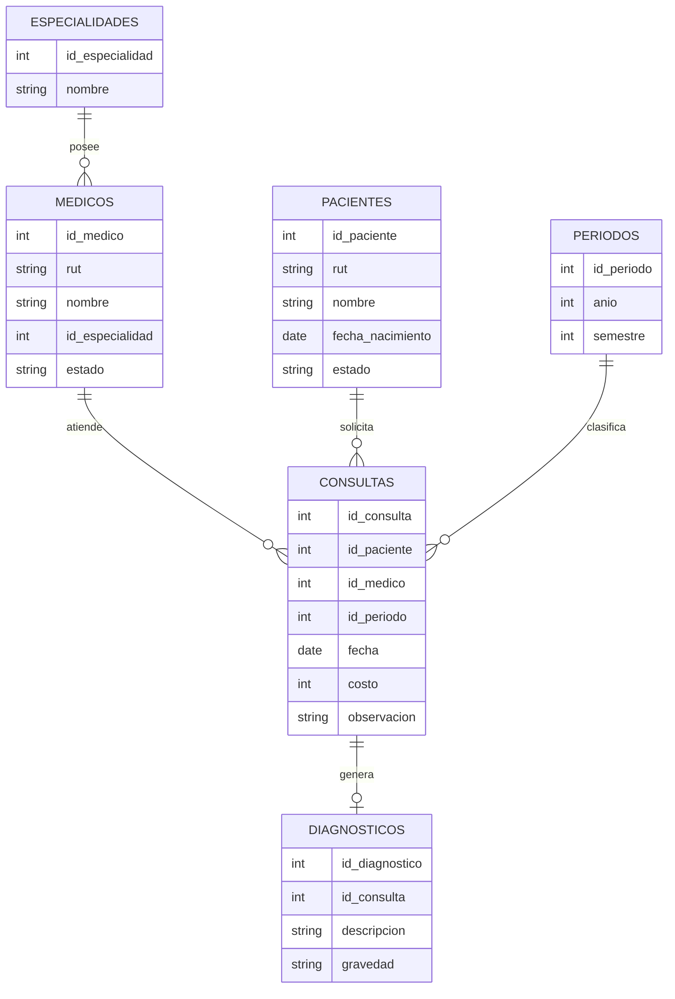

# 🏥 Clínica VidaPlus – Sistema de Base de Datos Relacional

## 📌 Descripción del Proyecto

El proyecto **Clínica VidaPlus** consiste en el diseño e implementación de una base de datos relacional en PostgreSQL, orientada a la gestión de información clínica en un centro de salud privado.

Representa una simulación de un sistema clínico real, permitiendo aplicar conceptos fundamentales de modelado de datos, SQL y análisis de información.

Este sistema permite centralizar y organizar datos relacionados con la atención médica, facilitando el análisis, control y consulta de información relevante.

---

## 🎯 Objetivos

* Modelar un sistema clínico real utilizando bases de datos relacionales
* Implementar tablas normalizadas con integridad referencial
* Gestionar información de pacientes, médicos y consultas
* Generar consultas SQL para análisis de datos

---

## 🧱 Estructura del Proyecto

```
/sql
├── schema.sql   → Definición de tablas y relaciones
├── seed.sql     → Inserción de datos de prueba
└── report.sql   → Consultas SQL (análisis del sistema)
```

---

## 🗂️ Entidades del Sistema

* **Pacientes**
* **Médicos**
* **Especialidades**
* **Consultas**
* **Diagnósticos**
* **Períodos clínicos**

---

## 🗺️ Modelo Entidad-Relación (MER)



---

## ⚙️ Tecnologías Utilizadas

* PostgreSQL
* SQL
* DBeaver
* GitHub

---

## 🚀 Instrucciones de Uso

1. Crear la base de datos:

```sql
CREATE DATABASE clinica_vidaplus;
```

2. Ejecutar el archivo `schema.sql`

3. Ejecutar el archivo `seed.sql`

4. Ejecutar el archivo `report.sql`

---

## 📊 Consultas Implementadas

El sistema incluye consultas para:

* Pacientes con y sin consultas
* Médicos sin atención registrada
* Consultas sin diagnóstico
* Promedios y totales por período
* Análisis de actividad médica

---

## 🔐 Consideraciones de Diseño

* Uso de claves primarias y foráneas
* Integridad referencial entre tablas
* Restricciones de validación (CHECK, UNIQUE)
* Modelo normalizado para evitar redundancia

---

## 👨‍🎓 Autor

*Víctor Erazo, Generation Javalimos. 2026*
